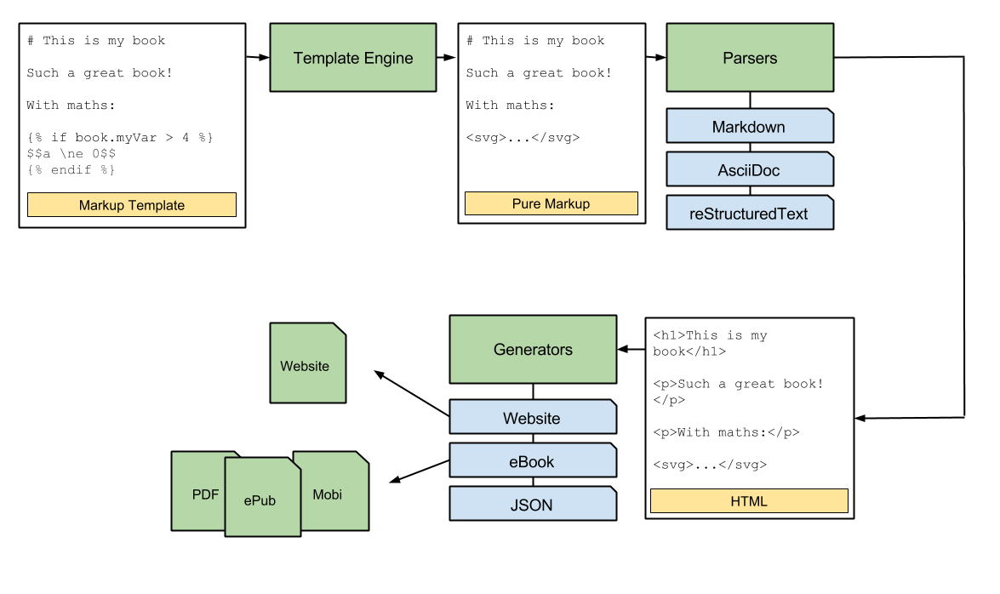
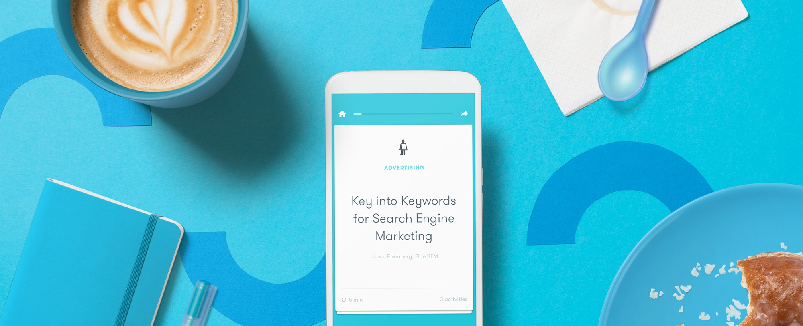

Test Content
=======

This file file serves as your book's preface, a great place to describe your book's content and ideas.

## Test PNG Image

Why is this a relevant topic for a blog about Agile software development?  Because it’s an argument you are going to have to have with you product owners sooner or later we might as well talk about it now.  A core concept in Agile is the concept of the minimum viable product, but the reality is that what a development team defines as a minimum viable product is not necessarily what a marketing or sales  or product team defines as the minimum product that they can utilize.  So let’s start with some definitions. 

## Testing SVG Image

What is Minimum Viable Product (MVP)?  As it is traditionally defined MVP is:

“MVP has just those features that allow the product to be deployed, and no more.  The product is typically deployed to a subset of possible customers, such as early adopters that are thought to be more forgiving, more likely to give feedback, and able to grasp a product vision from an early prototype or marketing information.” wikipedia.com

## Testing icon SVG

Investigate applying classes or options for formatting, resizing images. How can we easily apply a CSS class to the generated output? The answer is that separate stylesheets are available for each output format.

### Gitbook Processing

The Gitbook output processing looks like this:

## Test Table

| One | Two | Three | Four | Five |
| -- | -- | -- | -- | -- |
| Test how content is wrapped by default | When we have long strings in columns | It wraps based on equal percentages | Which looks good provided the viewport (for displays) is not too arrow | We can also add images like this **settings** icon  |
| 0:3 | 1:3 | 2:3 | 3:3 | 4:3 |
| 0:4 | 1:4 | 2:4 | 3:4 | 4:4 |
| 0:5 | 1:5 | 2:5 | 3:5 | 4:5 |

#### Test with a wide image

Test how large images are handled. Ideally we want to use `srcset` with viewport appropriately sized images. How will Gitbook handle this with printed and ebook output formats?

