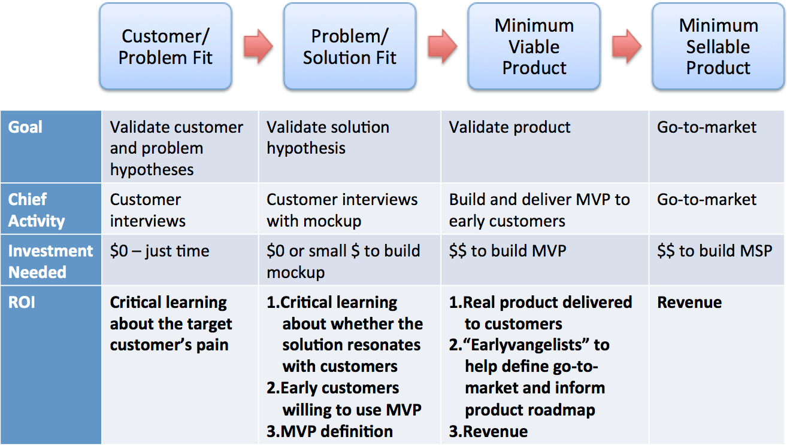

My Awesome Book
=======

This file file serves as your book's preface, a great place to describe your book's content and ideas.

Why is this a relevant topic for a blog about Agile software development?  Because it’s an argument you are going to have to have with you product owners sooner or later we might as well talk about it now.  A core concept in Agile is the concept of the minimum viable product, but the reality is that what a development team defines as a minimum viable product is not necessarily what a marketing or sales  or product team defines as the minimum product that they can utilize.  So let’s start with some definitions. 

What is Minimum Viable Product (MVP)?  As it is traditionally defined MVP is:

“MVP has just those features that allow the product to be deployed, and no more.  The product is typically deployed to a subset of possible customers, such as early adopters that are thought to be more forgiving, more likely to give feedback, and able to grasp a product vision from an early prototype or marketing information.” wikipedia.com
